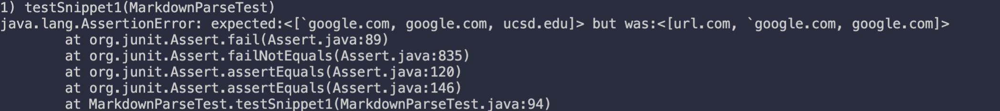
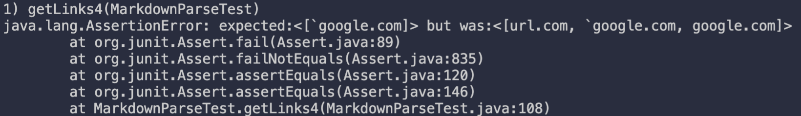
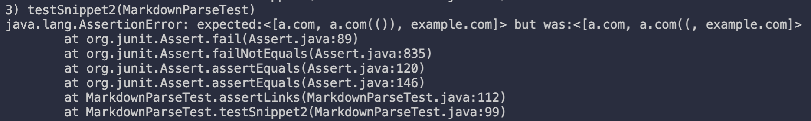
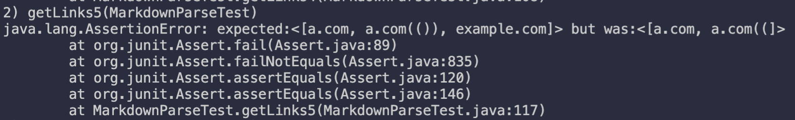
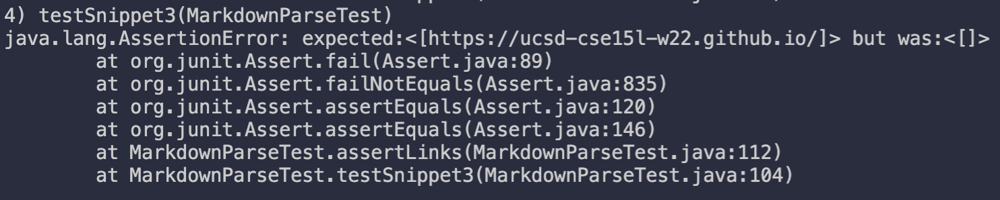
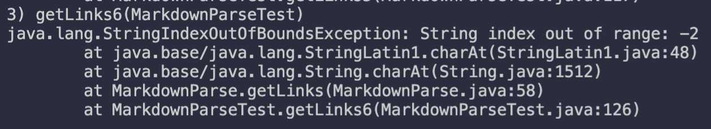

# Week 8: Fourth Lab Report

## [Our Repo](https://github.com/ocboogie/markdown-parse)

## [Review Repo](https://github.com/m1ma0314/markdown-parse)

## Snippet 1

```md
`[a link`](url.com)

[another link](`google.com)`

[`cod[e`](google.com)

[`code]`](ucsd.edu)
```

### Correct Ouput

According to the commonmark spec, there should be three links: "`google.com", "google.com" and "ucsd.edu".

### Added Test

To add the test, I copied the contents of snippet 1 into our `testCase` under
the name `snippet1`. With the help of our helper function `assertLinks`, I
can simply add a test with the following code:

```java
@Test
public void testSnippet1() throws IOException {
    assertLinks(List.of("`google.com", "google.com", "ucsd.edu"), "testCases/snippet1.md");
}
```

For the review repo, they already had the tests there, so I didn't need to add
them.

### Our Repo Test Output



### Review Repo Test Output



### Fix

This one would be difficult to fix and probably require a full "understanding"
of inline code in markdown. What I mean by "understand" is not in the human
sense, but in the program sense (e.g. make the program understand how inline
code works in Markdown). This would require a more involved approach to parsing
other than just using `findIndex`.

## Snippet 2

```md
[a [nested link](a.com)](b.com)

[a nested parenthesized url](<a.com(())>)

[some escaped \[ brackets \]](example.com)
```

### Correct Ouput

According to the commonmark spec, there should be three links:
"a.com", "a.com(())", "example.com".

### Added Test

Similar to snippet 1, I added the following code:

```java
@Test
public void testSnippet2() throws IOException {
    assertLinks(List.of("a.com", "a.com(())", "example.com"), "testCases/snippet2.md");
}
```

### Our Repo Test Output



### Review Repo Test Output



### Fix

Although we can fix with less than 10 lines of code, there is a good chance it
would break something else. To have a "good" working version, we would need a
more sophisticated approach. Perhaps, a stack to parse to links.

## Snippet 3

```md
[this title text is really long and takes up more than
one line

and has some line breaks](
https://www.twitter.com
)

[this title text is really long and takes up more than
one line](https://ucsd-cse15l-w22.github.io/)

[this link doesn't have a closing parenthesis](github.com

And there's still some more text after that.

[this link doesn't have a closing parenthesis for a while](https://cse.ucsd.edu/

)

And then there's more text
```

### Correct Ouput

According to the commonmark spec, there should be one link: "https://ucsd-cse15l-w22.github.io/"

### Added Test

Similar to snippet 1 and 2, I added the following code:

```java
@Test
public void testSnippet3() throws IOException {
    assertLinks(List.of("https://ucsd-cse15l-w22.github.io/"), "testCases/snippet3.md");
}
```

### Our Repo Test Output



### Review Repo Test Output



### Fix

Although this one wouldn't be clean of a fix, this is probably the easist fix.
We would have to do some checking of the next newline and such. However, this
could quickly grow into unmaintainability. So although it probably could be
done with less than 10 lines of code, it wouldn't be pretty and could break
other cases.
