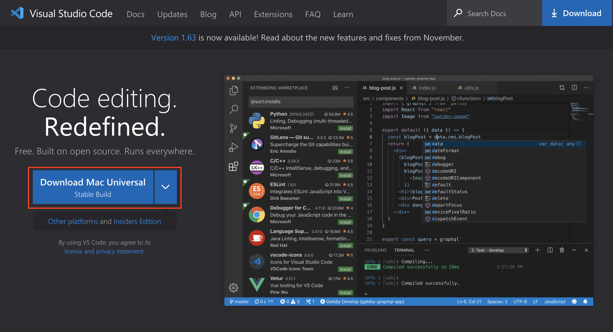

# Week 2: First Lab Report

## 1. Installing Visual Studio Code (VSCode)

Go to [code.visualstudio.com](https://code.visualstudio.com/) and download the corresponding installer for your OS.



The installation process is different for each OS, so I won’t be showing it here, however it should be like any other installer.

Once you have installed VSCode, open it and you should be presented with a screen like this:


You have successfully installed VSCode on your system.

## 2. Remotely Connecting to Your CSE 15L Account

Because you are a student of CSE 15L, you have your own account for the computers at UCSD and we are going to connect to those computers remotely.

If this is your first time using the ETS resources (if you don’t know what that means, this will probably be your first time), you must reset your UCSD password. Go to **[sdacs.ucsd.edu/~icc/index.php](https://sdacs.ucsd.edu/~icc/index.php)**, and under “Forgot Username or New Student?”, input your last name, student id, and hit “Submit”.


It should prompt you to input a new password. After you do so, you have successfully reset your UCSD password.

Now that you have have your account setup, you need to find your course-specific account for CSE15L. Go back to **[sdacs.ucsd.edu/~icc/index.php](https://sdacs.ucsd.edu/~icc/index.php),** and this time, input your information in “Account Lookup.” Once you have done, you should be presented with a screen like the following:


You will have a CSE 15L account ID that starts with `cs15lwi22`. The last few characters are specific to your account. Copy the account ID (including the last characters that are specific to you).

Now, we’re going to connect to the account using SSH.

> If you are running Windows, you must [install OpenSSH](https://docs.microsoft.com/en-us/windows-server/administration/openssh/openssh_install_firstuse) to use SSH.
> 

Go back to VSCode and open the terminal by going to Terminal→New Terminal in the menu or by pressing Ctrl or Command + ` (this is the backtick key which is the key right below the Esc key). Once you have that open, you should be presented with a terminal


(Don’t worry if yours doesn’t look exactly like mine. As long as have you a terminal looking thingy, you are fine)

Now in the terminal, you are going to type the following:

```bash
$ ssh <account ID here>@ieng6.ucsd.edu
```

where `<account ID here>` is your account ID that you’ll paste from early. For example, let’s say you’re account id was `cs15lwi22xyz`, then you’ll type:

```bash
$ ssh cs15lwi22xyz@ieng6.ucsd.edu
```

(Note: don’t include the `$` character at the beginning. This is used to differentiate input to the terminal and output from the terminal which you’ll see in a minute).

The first time you connect, you will get a message to do with "authenticity of host ... can't be established.” We’re going to just type `yes` and enter. (The details on why this comes up are long and complicated and can be found [here](https://superuser.com/questions/421074/ssh-the-authenticity-of-host-host-cant-be-established/421084#421084).) After you type `yes` and enter, you will be prompted to type in your password. Type in the password you set early when you reset your password. After this is done, a whole bunch of information should will be displayed to you. Overall, it should look something like this:

```bash
$ ssh cs15lwi22xyz@ieng6.ucsd.edu
The authenticity of host 'ieng6.ucsd.edu (128.54.70.238)' can't be established.
RSA key fingerprint is SHA256:ksruYwhnYH+sySHnHAtLUHngrPEyZTDl/1x99wUQcec.
This key is not known by any other names
Are you sure you want to continue connecting (yes/no/[fingerprint])? yes
Warning: Permanently added 'ieng6.ucsd.edu' (RSA) to the list of known hosts.
(cs15lwi22xyz@ieng6.ucsd.edu) Password: 
Last login: Mon Jan 10 16:26:59 2022 from ip68-101-116-221.oc.oc.cox.net
quota: No filesystem specified.
Hello cs15lwi22xyz, you are currently logged into ieng6-203.ucsd.edu

You are using 0% CPU on this system

Cluster Status 
Hostname     Time    #Users  Load  Averages  
ieng6-201   16:25:01   14  0.12,  0.23,  0.19
ieng6-202   16:25:01   11  4.10,  4.16,  3.99
ieng6-203   16:25:01   12  0.16,  0.26,  0.22

 
Mon Jan 10, 2022  4:29pm - Prepping cs15lwi22
[cs15lwi22xyz@ieng6-203]:~:1$
```

Now, you have successfully connected to a UCSD computer through SSH 🎉. Any command you type in will now run on the UCSD computer.

## 3. Run Some Commands

Now, try running some commands. Theses are some funs ones:

- `ls`
- `ls -al`
- `pwd`
- `factor 24`
- `cd <directory>` where `<directory>` is the folder on the host system
- `mkdir <directory>`
- `cat <file>`

To logout of the UCSD computer, you can run: `exit`.

Example of some file navigation: 


## 4. Copying Files to the Host

Hopefully, you have run some commands and know what some of them do. However, we still have no idea how to copy files from the client (your machine) to the host (UCSD computer). To do this, there is a command called `scp` (secure copy). This command will allow you to copy files from the your computer to the host, and must be ran on the client (not the host). So if you haven’t already, logout of the UCSD computer. Create a file named `stuff.txt` with the following content:

```
this is indeed stuff
```

Now, go back to the terminal and make sure you’re in the same directory as `stuff.txt` (you can see what directory you’re in with `pwd` and you can change directory with `cd`). Once you are in the same directory as `stuff.txt`, type the following command to copy it to the host:

```bash
$ scp stuff.txt cs15lwi22xyz@ieng6.ucsd.edu:~/
```

Enter your password like before, and you should have successful copied it over. Now, try going back to the host machine with the `ssh` command like before. Enter:

```bash
$ cat stuff.txt
```

You should see `this is indeed stuff` 🎉.

Example of the whole process: 


## 5. Making the Host Trust Us with SSH Keys

I’m sure you’re already tried of typing in your password. Now, imagine if you’re doing this everyday for work and a school project. What we’re going to do is make the host machine trust this client machine, so we don’t have to type in our password only more. On the client machine, type the following:

```bash
$ ssh-keygen
Generating public/private rsa key pair.
Enter file in which to save the key (/Users/dude123/.ssh/id_rsa): /Users/dude123/.ssh/id_rsa
Enter passphrase (empty for no passphrase): 
Enter same passphrase again: 
Your identification has been saved in /Users/dude123/.ssh/id_rsa.
Your public key has been saved in /Users/dude123/.ssh/id_rsa.pub.
The key fingerprint is:
SHA256:jZaZH6fI8E2I1D35hnvGeBePQ4ELOf2Ge+G0XknoXp0 dude123@dude123-machine
The key's randomart image is:
+---[RSA 3072]----+
|                 |
|       . . + .   |
|      . . B o .  |
|     . . B * +.. |
|      o S = *.B. |
|       = = O.*.*+|
|        + * *.BE+|
|           +.+.o |
|             ..  |
+----[SHA256]-----+
```

When it asks you for a passphrase, just hit enter. We don’t want a passphrase. Next, we have to create a folder on the host machine. If we’re just running one command on the host machine, we can add it to the end of our `ssh` command, and it will run that instead of putting us into the host machine. So, on the client, run:

```bash
$ ssh cs15lwi22zz@ieng6.ucsd.edu "mkdir .ssh"
<Enter password>
```

Now that we’ve created our ssh keys and made a directory on the host, we want to copy the public ssh key from our client machine to that new directory on the host system. If only there was a way to do this? We want to use our good pal, `scp`. To do so, we may run the following command on the client:

```bash
 $ scp ~/.ssh/id_rsa.pub cs15lwi22xyz@ieng6.ucsd.edu:~/.ssh/authorized_keys
<Enter password>
```

Now, try again to use the `ssh` command to get login to the host machine. You shouldn’t have to use your password!

With this, it should be as simple as: 

## 6. Getting Clever with SSH

Suppose you are working a Java project, and you have to constantly edit the Java file on your machine, copy it over to the host, compile it on the host, and finally run it on the host. We can make this process super quick with the power of the command line with the following command:

```bash
$ scp JavaFile.java cs15lwi22xyz@ieng6.ucsd.edu:~/ && ssh cs15lwi22xyz@ieng6.ucsd.edu "javac JavaFile.java && java JavaFile"
```

With one command, we can copy the file, compile the file, and run the file.

Exmaple of the whole process: 
