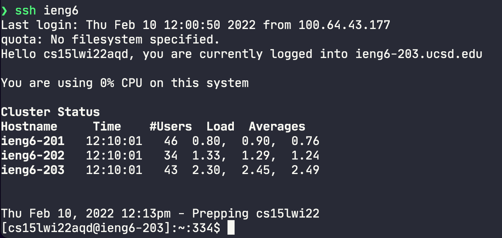

# Week 6: Third Lab Report

```
Host *
  AddKeysToAgent yes
  UseKeychain yes
  IdentityFile ~/.ssh/id_rsa

Host ieng6
    HostName ieng6.ucsd.edu
    User cs15lwi22aqd
```

I copied the code from the lab report. I opened the `~/.ssh/config` file with `vim`. I, then pasted the code into the file, but after the existing entry. After saving that, I should be able to use `ieng6` to `shh` into the computer.



This is a lot more simple than having to haul around the other link. The other link was large, and, of course, I don’t remember it, so I either have to keep going back in my bash history or copy it from somewhere. This, however, I can easily just type it out.


Again, this makes things just overall more simple. Although it’s not that big of change, it just makes the whole process easier. I don’t have to remember the whole link or copy it from somewhere.
